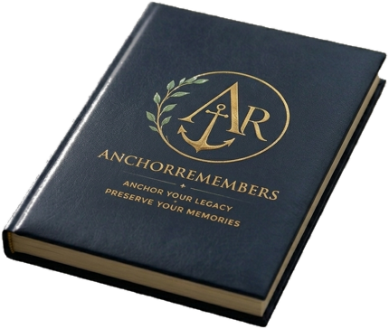

# AnchorRemembers — Build Handoff & Image Spec
*(Give this whole file to ChatGPT / Gemini so they have full context to generate assets and edit the code.)*

---

## 1. What this is
A **single self-contained `index.html`** — a responsive luxury landing page **plus** a working "memory book" web app (guided prompts, answers, photos, printable keepsake), all in one file.

- **No build step, no frameworks, no dependencies.** Inline CSS (`<style>`), inline JS (`<script>`), inline SVG logo + icons, data saved in the browser via `localStorage`.
- **Deploy =** drop `index.html` (+ optional images) into the repo root. Hosted on GitHub Pages at **anchorremembers.com**.
- Repo: `AcKccreate/anchor-remembers` (this branch on the source repo: `claude/session-L32eh`).

---

## 2. Design system  *(match all generated assets to this)*
| Token | Hex | Use |
|---|---|---|
| Navy | `#0D182A` | dark backgrounds, book cover |
| Antique Gold | `#D4AF37` | logo, accents, primary buttons |
| Gold Soft | `#E6C878` | gold highlights |
| Sage Green | `#A7B79A` | botanical/secondary |
| Warm Ivory | `#F5F1E8` | light surfaces |
| Cream | `#FBF6EC` | page background |
| Parchment | `#EFE5D2` | section bands |
| Ink | `#172033` | body text |

- **Type:** Headlines = serif (Georgia/Times, often italic for emphasis). Body = system sans-serif.
- **Logo:** gold `A·R` monogram with an integrated anchor, wrapped in a green-and-gold laurel wreath. The clean transparent master is **`logo.png`** in this folder.
- **Aesthetic:** editorial, heirloom luxury, warm, botanical, gilded — *"National Geographic meets luxury keepsake."*

---

## 3. Page structure (top → bottom)

**Landing (the marketing page):**
1. **Header** (cream): logo + "AnchorRemembers" wordmark + tagline + "Begin Your Book" button.
2. **Hero**: eyebrow "A Legacy Memory Book" · headline *"Every Family Has Stories Worth Saving."* · subcopy · two buttons · **book visual on the right** *(currently a CSS-drawn book — top candidate for a real photo, see Slot A)*.
3. **Feature strip** (4 gold line-icons): Captures What Matters · Preserve Their Voice · Creates Heirlooms · Private & Secure.
4. **Legacy band** (3 columns on desktop): **How It Works** (4 steps) · **Your Legacy Tree** (SVG tree + progress) · **Founder Edition** (unlock card, $5.99).
5. **Footer**.

**App (after clicking "Begin a New Memory Book"):** role/setup screens → Prompts tab → Archive tab → answer editor → print keepsake. *(Functional, not marketing — lower priority for imagery.)*

---

## 4. IMAGE SLOTS — what to generate (with ready-to-paste prompts)
Generate at the sizes below (PNG; transparent where noted). Keep the palette in §2.

### Slot A — Hero book *(highest impact)*
- **Where:** hero, right column (replaces the CSS `.book-scene`).
- **Size:** ~1000 × 1250 (4:5 portrait), transparent background preferred.
- **Prompt:** *"A luxurious deep navy-blue leather journal standing upright, with a gold embossed monogram crest (anchor wrapped in a laurel wreath) centered on the cover, resting on a few aged handwritten letters and a soft cream linen surface, warm side window light, shallow depth of field, editorial product photography, muted gold/ivory/sage palette, premium, photorealistic, transparent or clean cream background."*

### Slot B — Hero or section lifestyle
- **Where:** optional hero background or a "Designed With Intention" section.
- **Size:** ~1600 × 1200 (4:3).
- **Prompt:** *"Close-up of an older person's hands writing in a leather journal with a fountain pen, warm natural window light, cream and gold tones, tender and nostalgic, shallow depth of field, editorial lifestyle photography, soft film grain."*

### Slot C — Botanical accents *(adds the editorial feel)*
- **Where:** small decorative sprigs in section corners.
- **Size:** ~600 × 600, **transparent PNG**.
- **Prompt:** *"A single eucalyptus and olive-laurel sprig, soft sage-green leaves with delicate gold-tipped edges, isolated on a transparent background, pressed-botanical illustration style, elegant, minimal, no shadow."*

### Slot D — "How It Works" / journey image
- **Size:** ~1400 × 1000.
- **Prompt:** *"Three generations of a family looking through an old photo album together at a wooden table, warm golden-hour light, candid and emotional, cream and amber tones, editorial documentary photography."*

### Slot E — Journal collection gallery (3–4 small shots)
- **Size:** ~800 × 800 each.
- **Prompt:** *"A navy leather memory journal with gold laurel-anchor crest, flat-lay on cream linen with dried botanicals and a fountain pen, soft daylight, luxury stationery product photography."* (vary angle/props per shot)

> Tip for ChatGPT/Gemini: ask for **transparent background** on Slots A & C, and tell it the exact hexes in §2 so the gold/navy match the logo.

---

## 5. HOW IMAGES PLUG INTO THE CODE
All edits are in `index.html`. Put image files in the **same folder** and reference them relatively (e.g. `src="hero-book.png"`), or inline as base64 data URIs for a single self-contained file.

**A. Replace the hero CSS book with a photo** — find the block:
```html
<div class="hero-art">
  <div class="book-scene"> ... </div>
</div>
```
Replace the inner `.book-scene` with:
```html
<div class="hero-art">
  
</div>
```
Add to the `<style>`:
```css
.hero-photo{width:100%;max-width:430px;height:auto;display:block;margin:0 auto;
  filter:drop-shadow(0 24px 48px rgba(13,24,42,.35))}
```

**B. Section lifestyle background** — wrap any section:
```html
<section class="photo-band" style="background-image:url('lifestyle.jpg')"> ... </section>
```
```css
.photo-band{background-size:cover;background-position:center;position:relative}
.photo-band::before{content:'';position:absolute;inset:0;background:rgba(13,24,42,.45)} /* readability scrim */
```

**C. Botanical sprig accent** — drop into a section (which must be `position:relative`):
```html

```
```css
.sprig{position:absolute;width:120px;opacity:.85;pointer-events:none}
.sprig.tl{top:10px;left:10px} .sprig.br{bottom:10px;right:10px;transform:scaleX(-1)}
```

**D. Gallery grid:**
```html
<div class="gallery">
  
</div>
```
```css
.gallery{display:grid;grid-template-columns:repeat(3,1fr);gap:12px}
.gallery img{width:100%;border-radius:12px;box-shadow:0 6px 18px rgba(13,24,42,.1)}
```

---

## 6. Architecture notes for any AI editing this file
- **Use the `:root` CSS variables** (the tokens in §2) — never hardcode colors.
- **SVG sprite** lives right after `<body>`: it holds `#arEmblem` (the logo, an embedded PNG) and `#ic-*` line icons. Reference an icon with `<svg class="ic"><use href="#ic-book"/></svg>`. Icon classes: `.ic` (box-filled), `.ti` (tab), `.bi` (inline button), `.ci` (tiny inline), `.li` (lock).
- **Responsive:** mobile-first; desktop overrides are inside `@media(min-width:880px)`. The landing is one column on phones, multi-column on desktop (this is correct — match desktop to the wide mockup).
- **JavaScript:** vanilla, no libraries. Saves to `localStorage` keys `aw_anchor_remembers`, `aw_remembers_pro`, `aw_anchor_photos`. **Do not rename element IDs or `onclick` handler names** — the app wiring depends on them.
- **Keep it ONE file.** Deploy = commit `index.html` (+ any image files) to the repo root.

---

## 7. Files in this folder (current build)
- `index.html` — the complete site + app (real logo embedded, all icons, no emojis)
- `logo.png` — transparent master of the real AR logo (source for crests/icons)
- `og-image.png` — 1200×630 social share card
- `apple-touch-icon.png` — 180×180 iOS/home-screen icon
- `CNAME` — `anchorremembers.com` (binds the custom domain on GitHub Pages)

## 8. Workflow to finish the look
1. Generate the Slot A–E images with ChatGPT/Gemini using §4.
2. Either **send them to me** and I'll wire them into the slots in §5, **or** paste §5 + the images into ChatGPT/Gemini and have it edit `index.html`.
3. Commit the updated `index.html` + images to `AcKccreate/anchor-remembers`. Done.
